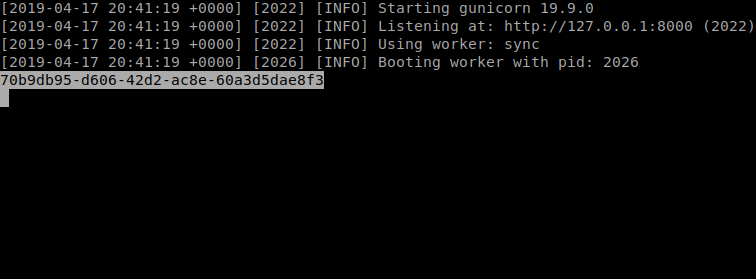
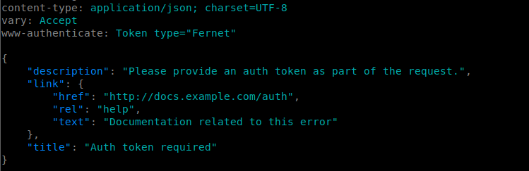
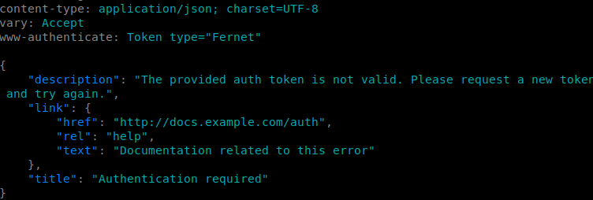
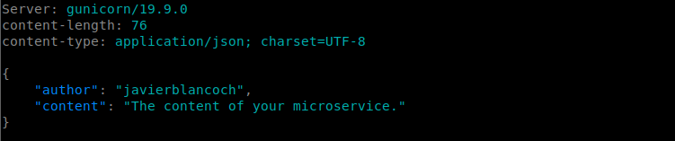

# Microservice
Example of microservice using Falcon, Token Authentication and generating an own token to access the content.

To execute we use
- gunicorn microservice_falcon:api

We will be able to observe in our terminal, the new generated token that we will use.

We will use HTTPie, let's see

We need an authentication token as we can see.

Let's put one and let's see what happens

As expected, the placed token is not valid

Finally let's test with the generated token that we have

cool!!!

## Credits
This project would not be possible without:
- https://falconframework.org/
- https://httpie.org/
